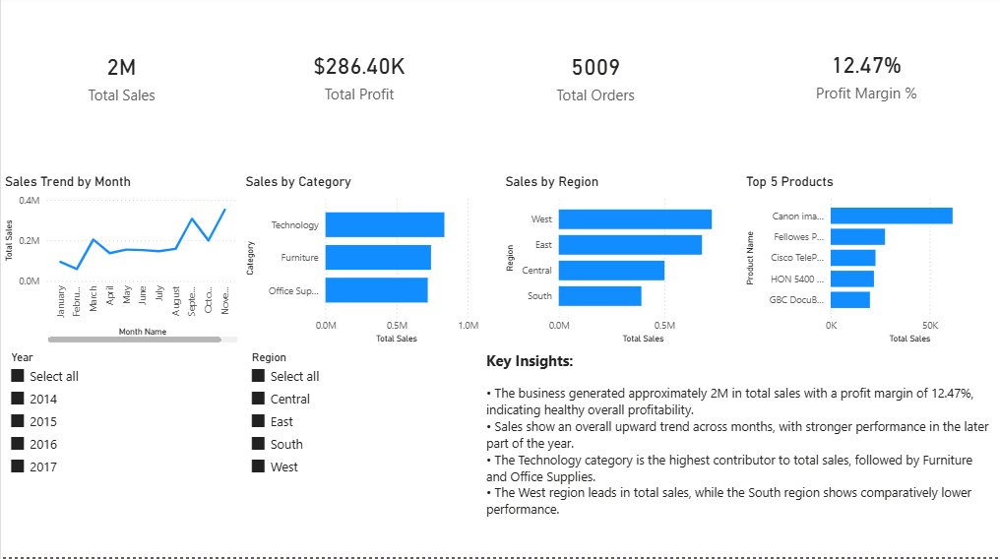
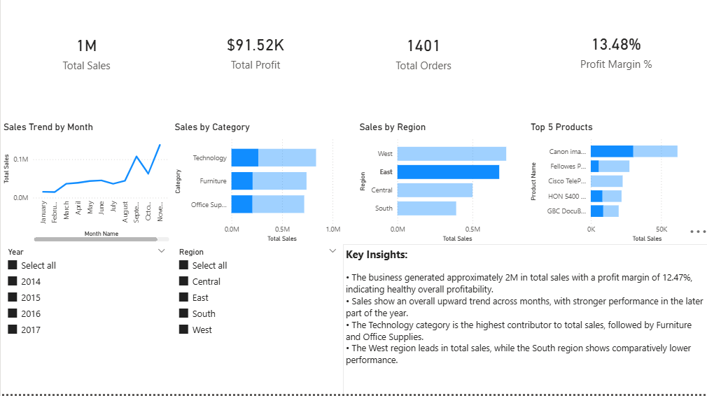

# Sales Performance Dashboard (Power BI)

## 📌 Overview
This project is a Sales Performance Dashboard built using Power BI to analyze retail sales data and derive meaningful business insights.

## 🎯 Objective
To analyze sales trends, profitability, regional performance, product categories, and top-selling products to support data-driven decision-making.

## 🛠 Tools Used
- Power BI  
- Power Query  
- DAX  

## 📊 Dashboard Features
- KPI cards for Total Sales, Total Profit, Total Orders, and Profit Margin
- Monthly sales trend analysis
- Sales analysis by product category and region
- Top 5 products by total sales
- Interactive slicers for Year and Region
- Business insights summary

## 🔍 Key Insights
- The business generated approximately 2M in total sales with a profit margin of 12.47%.
- Sales show an overall upward trend across months.
- Technology is the highest contributing category.
- The West region leads in total sales performance.

## 🖼 Dashboard Preview

## 📁 Files in This Repository
- `dashboard/sales_performance_dashboard.pbix` – Power BI dashboard file  
- `screenshots/` – Dashboard images  
- `README.md` – Project documentation  

## 📚 Dataset
Superstore-style dataset used for learning and analysis
